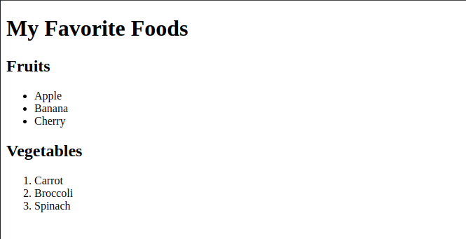

# Creating a Simple Document Structure
- Practice using headings and lists to create a basic HTML Document stucture.
### Objective
- Learn how to create nested lists within HTML
**Instructions**
1. Create an HTML file.
2. Add a title to your HTML document.
3. Inside the body, create a heading for the
main title of the document (e.g., "My Favorite Foods").
4. Under the main title, add a subheading for a section (e.g., "Fruits").
5. Create an unordered list of three fruits.
6. Add another subheading for a different section (e.g., "Vegetables").
7. Create an ordered list of three vegetables.

### Example
