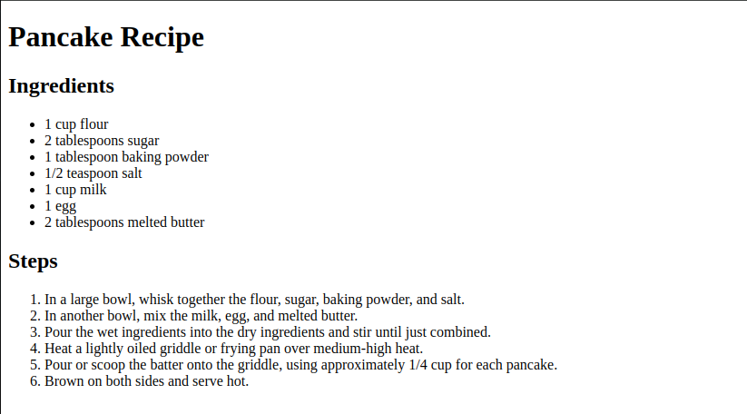

# Exercise 3: Combining Headings and Lists for a Recipe
### Objective
- Use headings and lists to create a structured recipe.

**Instructions:**

1. Create an HTML file.
2. Add a title for your HTML document (e.g., "Pancake Recipe").
3. Create a main heading with the name of the recipe (e.g., "Pancake Recipe").
4. Add a subheading for "Ingredients".
5. Create an unordered list of ingredients.
6. Add another subheading for "Steps".
7. Create an ordered list detailing the steps to make the pancakes.

### Example

